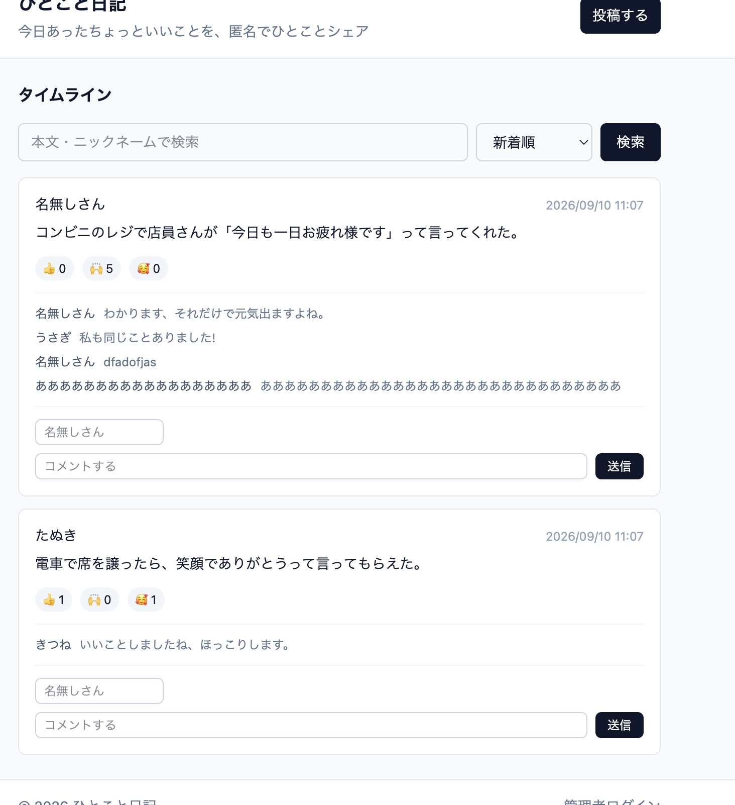
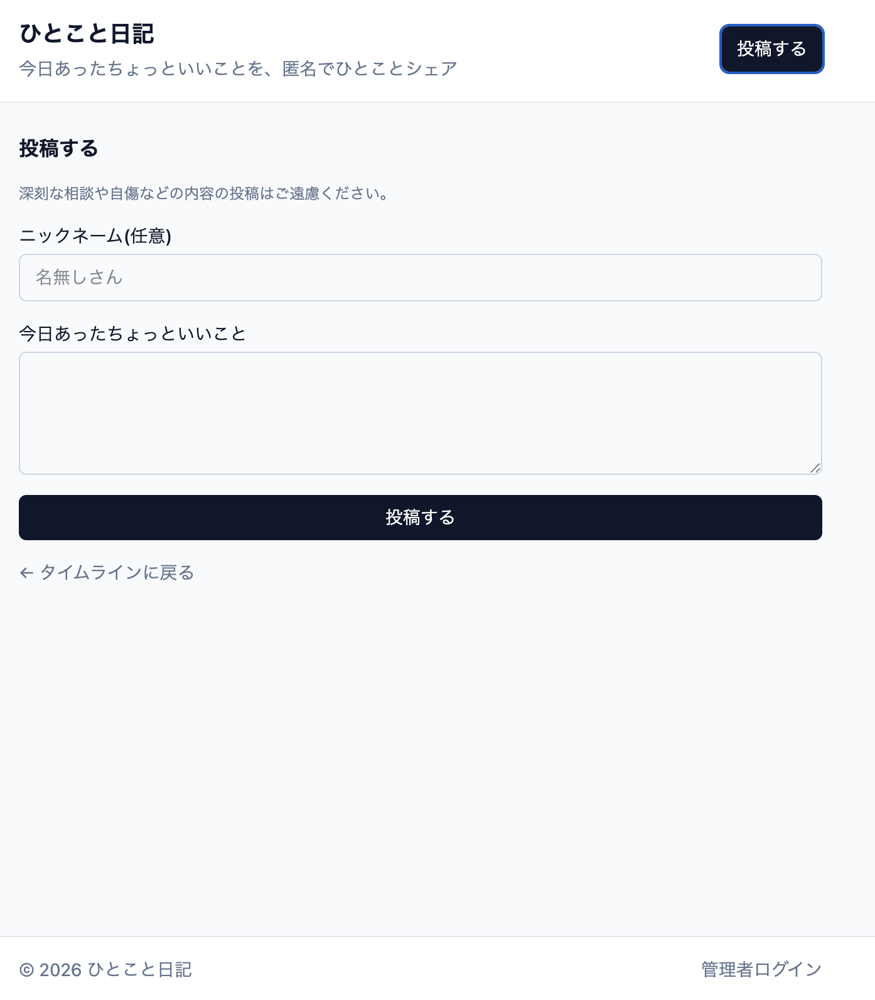
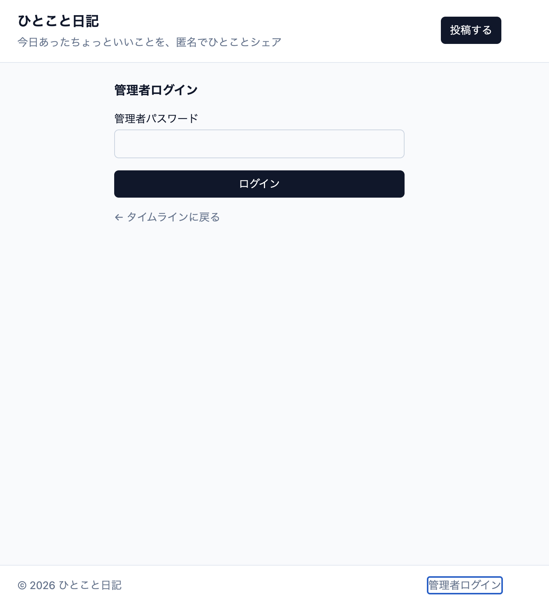
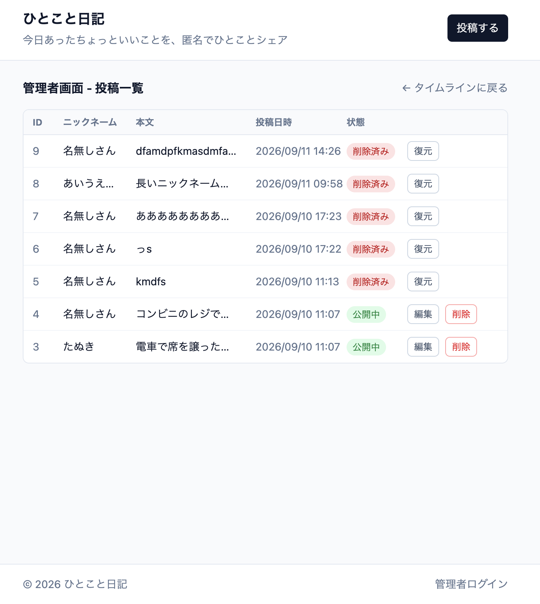
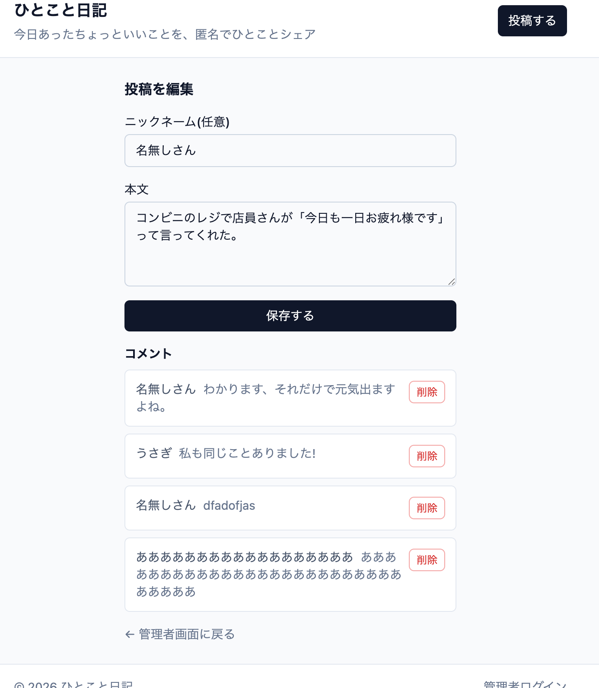

# ii-koto-diary（匿名「ひとこと日記」共有アプリ）

「今日あったちょっといいこと」を匿名で投稿し、みんなの投稿がタイムライン形式で流れる日記共有アプリです。

## 主な機能

### 一般ユーザー（ログイン不要）

- ニックネーム任意で「今日あったちょっといいこと」を投稿（140文字以内）
- タイムラインで全員の投稿を新着順に閲覧
- 本文・ニックネームでのキーワード検索
- 新着順／リアクション種類ごと（👍いいね・🙌わかる・🥰ほっこり）の多い順で並び替え
- 投稿へのリアクション付与
- 各投稿へのコメント（30文字以内、ニックネーム任意）
- スクロール中にページ先頭へ戻るボタン

### 管理者

- 固定パスワードでログイン（ログイン後12時間は再入力不要、ログアウトも可能）
- パスワードを連続して間違えると一時的にロック（同じIPから15分間に5回まで）
- 削除済みも含めた全投稿の一覧・検索
- 投稿の本文・ニックネームの編集
- 投稿・コメントのソフトデリート、および削除済み投稿の復元

### その他

- Server Actionで発生したエラー（バリデーション失敗など）を、Next.js標準の簡素な画面ではなく専用のエラー画面（`error.tsx`/`global-error.tsx`）で表示

詳しい要件は [requirements.md](./requirements.md) を参照してください。

## スクリーンショット

| タイムライン | 投稿 |
|---|---|
|  |  |

| 管理者ログイン | 管理者画面（投稿一覧） |
|---|---|
|  |  |

| 投稿編集画面 |
|---|
|  |

## 技術スタック

- Next.js 16 (App Router, Turbopack)
- React 19
- Prisma + PostgreSQL
- Tailwind CSS

## クローン後のセットアップ

このリポジトリは pnpm と Dev Container を使用しています。`.pnpm-store` や `node_modules` などのビルド成果物は `.gitignore` の対象で、リポジトリには**コミットされていません**。クローン後は自分で依存関係をインストールする必要があります。

### VS Code Dev Containers（推奨）

1. リポジトリをクローンし、VS Code で開く。
2. [Dev Containers 拡張機能](https://marketplace.visualstudio.com/items?itemName=ms-vscode-remote.remote-containers) をインストールしていない場合はインストールする。
3. **Dev Containers: Reopen in Container** を実行する。Docker イメージがビルドされ、`.devcontainer/devcontainer.json` の `postCreateCommand` によって自動的に `pnpm install` が実行される。
4. コンテナの準備ができたら、統合ターミナルで `pnpm dev` を実行する。

セットアップ後、ブラウザで [http://localhost:3001](http://localhost:3001) を開くと確認できます。

Dev Containersを使わない方法（Docker Composeを直接操作する/ローカルのNode.jsを使う）は [docs/setup-alternatives.md](./docs/setup-alternatives.md) を参照してください。

## 環境変数

`.env.example` をコピーして `.env` を作成してください。

```bash
cp .env.example .env
```

| 変数名 | 説明 |
|---|---|
| `DATABASE_URL` | アプリ(Prisma)が接続するDB。ローカルDocker用ならそのままでOK |
| `ADMIN_PASSWORD` | 管理者画面(`/admin`)のログインに使う固定パスワード。好きな値に変更してください |
| `POSTGRES_USER` / `POSTGRES_PASSWORD` / `POSTGRES_DB` | Docker ComposeがPostgreSQLコンテナ初期化時に使う値。`DATABASE_URL`の接続情報と一致させること。これが無いとDBコンテナが起動できません |
